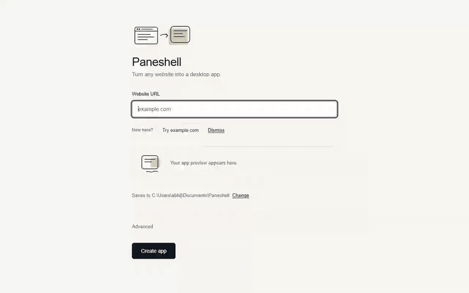

# Paneshell

Paste a URL, get a desktop app project for Windows, macOS and Linux. Free, local, no account, and the project it writes is plain Electron code that you own.



[Watch the demo video (mp4)](brand/demo/demo-final.mp4) | Site: https://paneshell.abhijat.co.in

## How it works

1. **Paste a URL.** Paneshell reads the site's title and icon and fills in the app name and icon for you. You can edit both.
2. **Check the preview.** The output goes to a default folder (with a "Change" link) unless you pick another.
3. **Create the app.** You get an Electron project with a `paneshell.config.json`, an icon, and build scripts for Windows, macOS and Linux.

Status: creating the project works. Building the installer from inside the app is in progress; until it ships, you build with the commands below (Node.js required).

## Install and run

Requires Node.js (the current LTS is a safe choice) and npm.

```
npm install
npm start           # runs Paneshell in development
```

## Build installers

```
npm install
npm run dist        # builds for whatever OS you're on
npm run dist:win     # .exe (NSIS) — build on Windows, or a Windows CI runner
npm run dist:linux   # .deb — build on Linux
npm run dist:mac     # .dmg — build on macOS
npm run pack         # unpacked app folder only, useful for checking size
```

Output lands in `dist/`. Cross-building a `.dmg` from Linux/Windows isn't
reliable (Apple's tooling and code signing are macOS-only), and a clean
`.exe` build wants Windows or Wine. The included
`.github/workflows/build.yml` builds all three on their native OS via
GitHub Actions — push a tag like `v1.0.0` or run it manually from the
Actions tab, then download the three artifacts.

Before shipping, replace `build/icon.png` with your own 1024×1024 icon —
the one included is a placeholder.

## Install a built installer

- **Windows** — run `Paneshell-Setup-<version>.exe`. It's an NSIS
  installer with `allowToChangeInstallationDirectory` on, so the user picks
  a folder and gets Start Menu + desktop shortcuts.
- **Linux (Debian/Ubuntu)** — `sudo dpkg -i paneshell_<version>_amd64.deb`
  (or double-click it in a graphical package manager). It registers a
  `.desktop` entry and appears in the app menu.
- **macOS** — open the `.dmg`, drag Paneshell into `Applications`.

## Uninstall

- **Windows** — Settings → Apps → Paneshell → Uninstall (NSIS writes a
  real uninstaller and registry entry, so it shows up there normally).
- **Linux** — `sudo apt remove paneshell` (or `sudo dpkg -r paneshell`).
- **macOS** — drag Paneshell from `Applications` to the Trash.

None of these leave background services or daemons running — the app has
no installer scripts beyond what electron-builder generates, so uninstall
is a plain removal on every platform.

## What gets generated

Each wrapped site becomes its own folder:

```
<app-name>/
  paneshell.config.json   settings the app reads at startup
  main.js               Electron main process; reads the config
  preload.js
  index.html
  build/icon.png
  package.json          electron-builder config and dist:* scripts
  README.md
```

### `paneshell.config.json`

Every feature of a generated app is a key in this file, so you change behavior by editing JSON, not code. Keys today:

```json
{
  "url": "https://example.com",
  "name": "Example",
  "window": { "width": 1200, "height": 800 },
  "openExternalLinksInBrowser": true,
  "singleInstance": true
}
```

- `url` — the site the app loads.
- `name` — the window title and app name.
- `window.width`, `window.height` — starting window size in pixels.
- `openExternalLinksInBrowser` — links to other origins open in your default browser instead of the app window.
- `singleInstance` — opening the app a second time focuses the first window.

More options (tray, custom CSS and JS, permissions, user agent) are planned as new keys. See `docs/marketing/` and `TODO.md` for status.

The generated project is yours. Paneshell adds no telemetry or licence requirement to it.

## Project layout

```
src/main/          Electron main process: main.js (window, IPC, input checks),
                   generator.js (writes the project), preload.js (bridge to the UI)
src/renderer/      The UI: index.html, renderer.js, styles.css, tokens.css
build/icon.png     App icon (replace with your own)
tests/             Automated tests (folder to be added; not present yet)
docs/marketing/    Positioning, competitors, pitch, pricing, Product Hunt and demo script
.github/workflows/ Three-OS installer build
../website/        Landing site (static HTML and CSS), a sibling folder of this repo
```

## Limitations

- **Size.** Electron bundles Chromium. Electron's own 44.4.5 runtime archive is 123 MB (Linux) to 158 MB (Windows), before any app code. Tauri-based tools such as Pake and PakePlus claim under 10 MB and under 5 MB. Run `npm run dist` or `npm run pack` and check `dist/` for your real numbers.
- **Unsigned installers.** Installers are not code-signed unless you add your own certificate. Windows SmartScreen and macOS Gatekeeper will warn users. Signing and notarization are planned, not done.
- **Cross-building.** Build each installer on its own OS, or use the GitHub Actions workflow. A `.dmg` cannot be reliably built off macOS.
- **Building needs Node today.** In-app build is in progress; until then you need Node.js and npm to produce an installer.
- **Sites you wrap.** Wrap only sites you own or have permission to package. Copyright, trademark and the site's terms of service still apply, and you are responsible for what you distribute. Some sites block or degrade embedded browsers, or require sign-in flows that do not work in a wrapper.

## How it compares

Facts checked 2026-09-25 with sources in `docs/marketing/02-competitors.md`. Vendor claims are marked.

| Tool | Runs | Output | Needs terminal | Price |
|---|---|---|---|---|
| Paneshell | Local GUI | Electron project and installers (Win, macOS, Linux) | Not for project creation; builds today need Node | Free |
| Pake | Local CLI, or GitHub Actions | Tauri apps, under 10 MB (vendor claim) | Yes | Free, GPL-3.0 with output exception |
| PakePlus | Local GUI; cloud build needs a GitHub token | Tauri apps, under 5 MB (vendor claim) | No | Free, MIT |
| Nativefier | Local CLI | Electron apps | Yes | Free, MIT; archived since 2023-09-29 |
| WebCatalog | Desktop app (Electron) | Apps inside its own workspace; installer export not verified | No | Free for 2 apps; Pro from $5 per user per month billed annually |
| Websktop | Hosted | Windows, macOS, Linux installers (vendor claim) | No | Free tier, then $10 per app and $2 per build (vendor page) |
| Chrome / Edge "Install page as app" | Browser | Browser-managed shortcut for one user | No | Free |

Pick Pake or PakePlus if size matters most. Use the browser's install option for your own use. Paneshell is for when you want a local GUI, no per-app fees, and a project you can edit and hand to others.

## License

MIT, see `LICENSE`. Author: Abhijat. Contact: abhijat.tech@gmail.com. Generated projects are yours regardless of the licence chosen for this tool.
